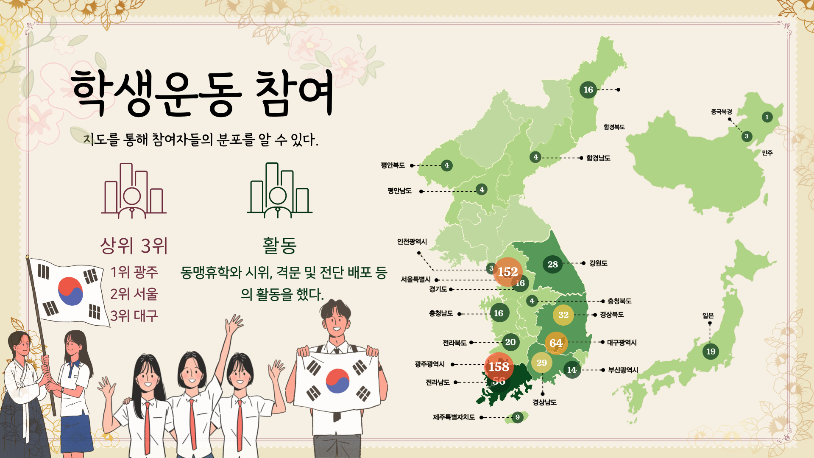
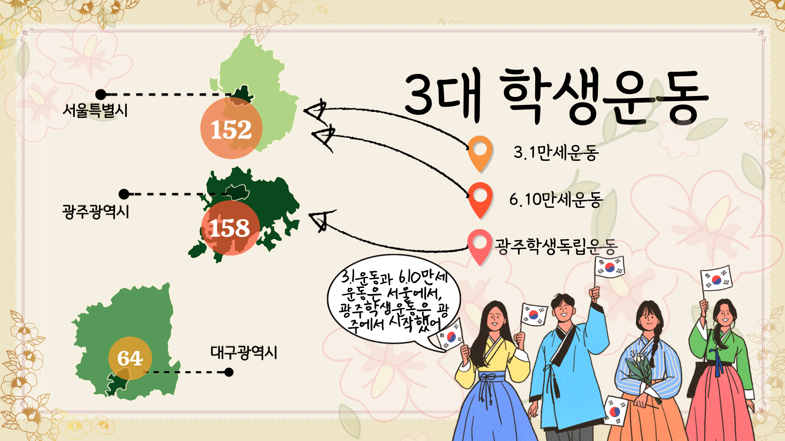
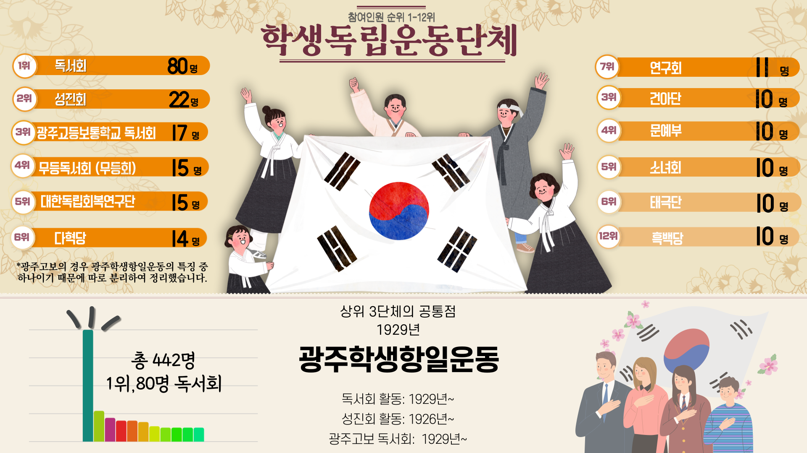
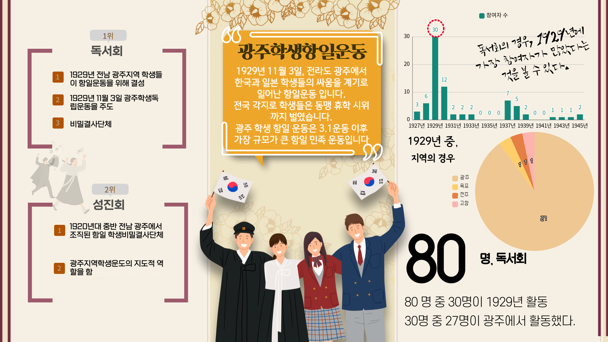
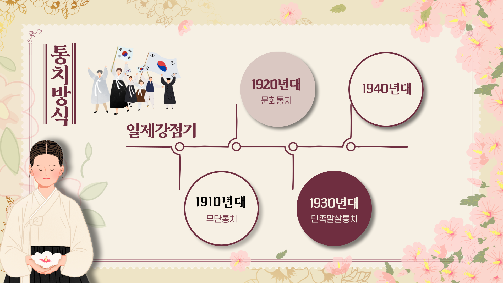
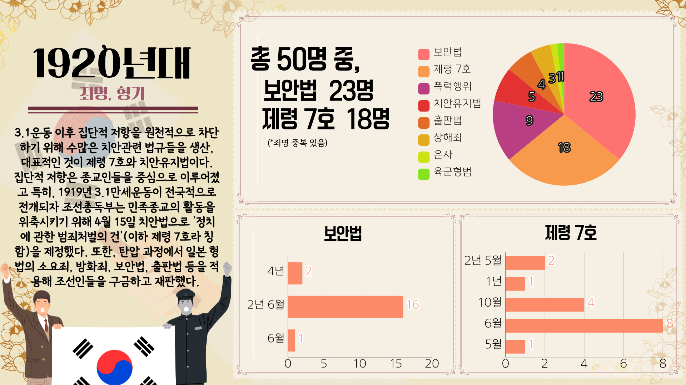

> ## 공훈록 사건정보 분석
> 1. 공훈전자사료관에서 배포하고 있는 공훈록을 토대로 사건분석하여 인포그래픽을 제작
> 2. 국가보훈처에서 팀원과 같이 제작했던 프로젝트 소스코드 및 결과물
 

* 결과물  
 
 
 
 

> ### :heavy_check_mark: 프로젝트 개발환경  
> 1. Windows 10 Pro 64bit, x64 기반 프로세서, RAM 16GB  
> 2. Python 3.8.10  
> 3. wordcloud-1.8.1-cp38-cp38-win_amd64  
> 4. JPype1-1.1.2-cp38-cp38-win_amd64  
> 5. jdk-17_windows-x64_bin  
> 6. mariadb-10.6.4-winx64  
> 7. Anaconda3-2021.05-Windows-x86_64  
 

> ### :heavy_check_mark: 개발언어  
> 1. Python
 

> ### :heavy_check_mark: 개발도구 프로그램  
> 1. Jupyter Lab, Visual Studio Code  
> 2. HeidSql  
> 3. Qgis DeskTop 3.16.15 with grass 7.8.5  
